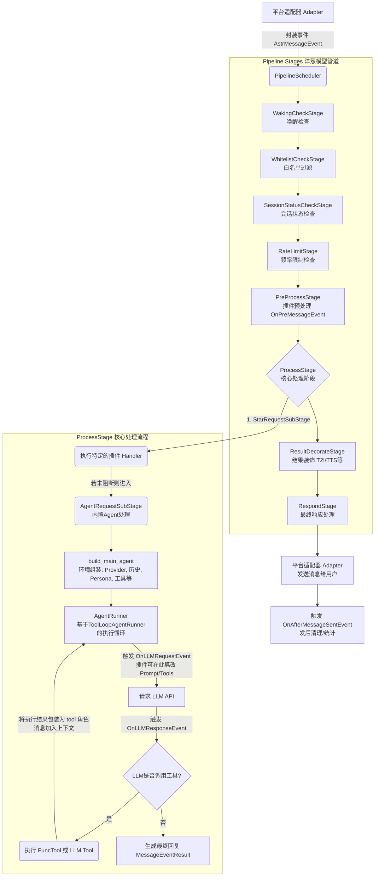

# AstrBot-Lite 消息处理全链路分析

本文档详细描述了 AstrBot-Lite 从接收到消息到发出回复的完整调用链条，涵盖了内置 Agent 逻辑、插件点位、Prompt 构建及工具调用过程。

---

## 1. 消息接收与管道流转图 (Message Pipeline Flow)

以下是 AstrBot 核心消息流转生命周期的抽象模型：

---

## 2. 管道阶段执行与会话隔离 (Pipeline Stages & Isolation)

`PipelineScheduler` 按照 `STAGES_ORDER` 依次执行各个阶段。除了基础的检查外，AstrBot 在管道中深度融合了会话级别的隔离与管理：

### 会话隔离与状态管理 (Conversation Management)
AstrBot 基于 `SessionServiceManager` 和 `Conversation` 实现上下文隔离。系统通过 `unified_msg_origin`（平台名+群组ID+用户ID的混合哈希）将不同场景独立映射为一个个独立的 Session。
- **持久化隔离**: 会话数据（包括历史对话 History 和当前选择的 Persona）被保存在数据库的 `conversation` 表中。
- **插件深度介入**: 
  - 插件可通过 `context.conversation_manager` 获取或修改当前会话状态。
  - 在 `OnPreMessageEvent` 阶段，插件可以强制改变当前请求所绑定的 `session_id`，实现**跨端会话互通**或**会话劫持**。
  - 插件可以直接读写 `conversation.history`，手动修剪上下文或插入不可见的系统级记忆。

---

## 3. 核心处理阶段与周边 Agent 管理系统

### 3.1 StarRequestSubStage (纯插件接管)
此时系统执行由 `@event_message_type` 注册的插件 Handler。若插件完整消费了事件，则提前返回 `MessageEventResult`；若插件需要借助大模型能力，可返回 `ProviderRequest`，将任务转交内置 Agent 代办。

### 3.2 AgentRequestSubStage (内置 Agent 驱动)
此阶段是 AstrBot 大脑真正运作的区域，通过 `build_main_agent` 构建一个功能完备的“实例”，它不仅依赖 LLM，更依赖一套动态的“周边环境”：

#### A. Agent 环境构建 (build_main_agent)
1.  **多模态提取**: 提取用户发送的图片、语音，根据策略压缩或转换为 URL 传入。处理引用回复（Quoted message）中的媒体并转换为 fallback 附件。
2.  **提供商路由**: 根据 `selected_model`、提供商配置以及设定的 `fallback_providers`，选取当前可靠的大模型接入层。
3.  **上下文装载**: 获取上述隔离的会话 `req.contexts`。
4.  **人格与提示词组装 (Persona Injection)**: 
    *   **基础预设**: 加载全局安全模式配置 (`llm_safety_mode`) 等默认 Prompt。
    *   **Persona 人格覆盖**: 读取当前会话挂载的 Persona 角色配置，将其设定的 `prompt` 强插至 `req.system_prompt`，并把人格自带的开场白（`_begin_dialogs`）重构到历史记录顶端，以此实现精准的“入戏”。
5.  **周边能力注册 (Skills & Tools)**:
    *   汇总系统的原生能力（Cron工具、主动发信工具、沙盒环境工具）、Persona 携带的专有能力，以及第三方插件通过 `@command` 暴露的本地函数。
    *   转换所有函数签名为对应大模型平台支持的 JSON Schema (Function Calling)。

#### B. 调度循环执行 (run_agent)
将构建完毕的 `ProviderRequest` 放入 `AgentRunner` 的状态机中，采用 ReAct 思维进行多次迭代（思考-工具调用-再次思考），直到模型输出面向用户的最终回复或达到最大迭代步数 (`max_step`)。

---

## 4. 插件的深度 Prompt 注入与环境操控点位

插件系统在 AstrBot 的生命周期中拥有极高的系统级权限，主要可通过以下三种维度介入提示词工程和流转链条：

### 4.1 显式生命周期 Hook (Event Hooks)
*   **`OnPreMessageEvent` (预处理层)**: 
    *   **时机**: 处于 `PreProcessStage`，尚未进入 Agent 解析流程。
    *   **应用**: 适合做输入预处理。修改 `event.message_str`（如过滤违禁词、用户方言翻译为普通话）；拦截特定正则的指令直接熔断管线返回。
*   **`OnLLMRequestEvent` (请求发出前/核心注入点)**: 
    *   **时机**: `ProviderRequest` 对象已完全组装完毕，含有最全的 System Prompt、Context 和 Tools，即将向 Provider 发送 HTTP 请求的前一刻。
    *   **应用**: 
        1. **动态 Prompt 注入**: 依据当前时间和天气，在 `req.system_prompt` 尾部追加临时知识（如 "今天是星期一，你要显得充满干劲"）。
        2. **RAG 文本召回**: 插件拦截此事件，对用户 `prompt` 查向量数据库，将相似段落拼接入 `req.system_prompt` 作为参考材料。
        3. **工具动态裁剪**: 删除 `req.func_tool` 中当前场景不应触发的危险工具。
*   **`OnLLMResponseEvent` (响应捕获后)**:
    *   **时机**: 刚收到 LLM 答复，尚未加入下一次思考轮次或返回给用户。
    *   **应用**: 拦截识别 LLM 的结构化输出，执行副作用逻辑并重新改写 LLM 的原始答复。

### 4.2 隐式工具注入 (Function Calling Injection)
*   通过 `@command` 装饰的插件函数。这不仅仅是指令解析，它会在后台**透明地修改发送给 LLM 的 Payload**，使其包含工具的说明。使得模型“认知”到自己拥有该能力，从而改变其生成思维链的导向（例如从“我不知道时间”变为“我应该调用 `get_time` 函数”）。

### 4.3 长效状态与人格操控
*   插件可以跨过事件生命周期，直接调取 `db` 或 `conversation_manager`，对 Persona 的绑定进行持久化修改。这就意味着插件不仅能做单次响应注入，还可以完成如“好感度系统”这类的功能：好感度不同时，插件悄悄替换掉会话当前使用的 Persona，实现人设的永久性跃迁。

---

## 5. 重构启示与架构优化展望

基于现有链路的观察，以下是在大型项目和多模态 Agent 发展方向上的改进重点：

1.  **Agent 实体分离与工厂模式化 (Agent Entity)**:
    现在的 `build_main_agent` 过程过于冗长且包含了所有的兜底和参数挂载逻辑。未来可以将其拆分为独立的 `Agent` 类或采用 Factory 模式，使得 AstrBot 能更方便地同时编排多个不同的 Agent 实体（如：主导聊天的 Agent、专职搜索的 RAG Agent、审核内容安全的 Agent）。
2.  **模块化的 Prompt 模板引擎 (Prompt Template Engine)**: 
    目前 System Prompt 的生成逻辑（Persona、上下文补充、时间地点拼接）散落在主函数中，通过简单的字符串相加实现。重构时应引入 Jinja2 之类的模板管理器，这不仅能提升代码可读性，还能精细化管理插件对不同模板块的**注入权重与顺序**。
3.  **生命周期并发管理与熔断 (Concurrency & Timeout Control)**: 
    由于管线采取顺序链式执行，某一个挂载在 `OnPreMessageEvent` 或 `OnLLMRequestEvent` 的不良插件如果在遇到网络 I/O 阻塞，将拖慢整条链路。未来需为事件总线引入协程级的并发执行策略、超时控制和熔断降级（Circuit Breaker）机制。